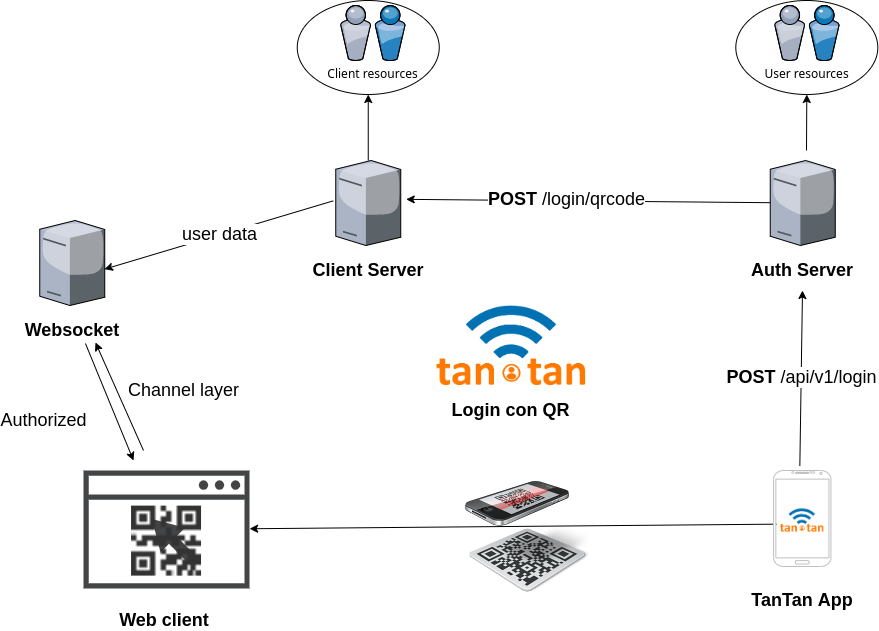

# Login QR TanTan Demo




## Project setup

```
npm install
```

### Compiles and hot-reloads for development

```
npm run serve
```

### Compiles and minifies for production

```
npm run build
```

### Lints and fixes files

```
npm run lint
```

## Example usage

```html
<script src="/reconnecting-websocket.min.js" type="text/javascript"></script>
<script>
  document.addEventListener("DOMContentLoaded", function() {
    // setup client credentials as cookies
    var client_id = "YOUR_CLIENT_ID";
    // ...

    // Correctly decide between ws:// and wss://
    var ws_scheme = window.location.protocol == "https:" ? "wss" : "ws";
    var ws_path =
      ws_scheme +
      "://" +
      window.location.host +
      "/login/stream/?client_id=" +
      client_id;
    console.log("Connecting to " + ws_path);
    var socket = new ReconnectingWebSocket(ws_path);

    // Handle incoming messages
    socket.onmessage = function(message) {
      // Decode the JSON
      console.log("Got websocket message " + message.data);
      var data = JSON.parse(message.data);

      // Handle errors
      if (data.error) {
        alert(data.error);
        return;
      }

      switch (data) {
        case "qrcode":
          // obtain token and embed as QR data
          console.log(data.qr_data); // https://loginqr.tantan.solutions/TOKEN
          break;
        case "authorized":
          // success user login
          console.log(data.user_info);
          break;
      }
    };
  });
</script>
```

- https://www.npmjs.com/package/vue-simple-websocket
- https://www.npmjs.com/package/simple-ng-websocket
- https://www.npmjs.com/package/reconnecting-websocket

### Test Server

- http://3.16.112.239:8000/

### References

### Customize configuration

See [Configuration Reference](https://cli.vuejs.org/config/).
